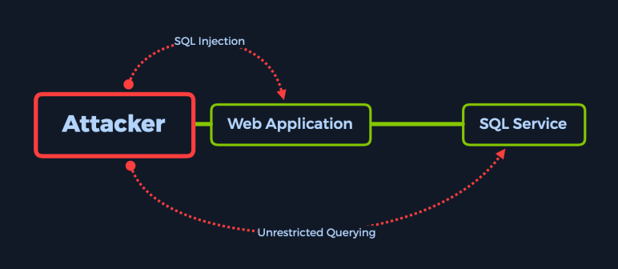

Beschäftigt man sich mit der Informatik dann kommt man zwangsläufig irgendwann mit SQL  in Berührung.  Die Structured Query Language ist ein integraler Bestandteil von Datenbanksystemen. Oft werden solche Datenbanken benutzt um Usernames und Passwörter abzuspeichern.

Erstellt man einen Login muss man darauf achten, dass man sich nicht für eine SQL-Injection verwundbar macht.

## How did we get here?

Angefangen hat es mit der ersten etwas komplexeren VM auf hackTheBox. Hierbei geht es um eine Maschine, auf der eine mysql-Datenbank läuft, die für die Speicherung der Login-Daten einer ebenfalls auf dieser Maschine laufenden Webapplikation zuständig ist.

## Wie funktioniert das ganze jetzt?

SQL Injection ist eine gängige Methode zur Ausnutzung von Webseiten, die SQL-Anweisungen verwenden, um die Daten von Benutzern abzurufen und zu speichern.  Bei falscher Konfiguration kann man mit diesem Angriff die bekannte SQL Injection Sicherheitslücke ausnutzen. Es gibt viele verschiedene Techniken zum Schutz vor SQL Injektionen zu schützen z.B. Inputvalidation, parametrisierte Abfragen. Allerdings gibt es jedoch Fälle, in denen keine dieser Maßnahmen getroffen wurden, weshalb diese Art von Angriffen auch auf der OWASP Top 10 Liste der Webvulnerabilities weit oben steht (Vormals Platz 1, jetzt auf Platz 3).



Das Ziel einer SQL-Inejection ist in diesem Fall das Umgehen der Passwortabfrage. Hierfür schaut man sich am besten ein Beispiel an wie Authentifizierung funktioniert. Da die Funktionalität des Logins in PHP erstellt wurde hilft es , sich diesen Code näher anzusehen. Besonders die Stelle an der die Query erstellt wird ist interessant.

```sql
$sql="SELECT * FROM users WHERE username='$username' AND password='$password'";
# Query for user/pass retrieval from the DB.
```

Man beachte, dass in PHP alles was nach einem # kommt zu einem Kommentar wird. Dies kann man sich bei einem Angriff zu nutze machen, in dem man die $username Variable mit einem ;# beendet.

Einfach gesagt beendet man einfach die SQL-Abfrage nach der Eingabe des Usernames in dem die Passwortabfrage auskommentiert wird. Somit würde die Query dann wie folgt aussehen:

```sql
$username = admin';#
$password = abc123
"SELECT * FROM users WHERE username='admin';#' AND password='$password'";
```

Somit wird der hintere Teil auskommentiert und der Check des Passwortes entfällt.
Fazit

Es ist wichtig, zu wissen wie die verwendete Programmiersprache Userinputs handhabt. Ein solche Attacke wäre z.B. nicht möglich wenn die Eingabe zuerst von einer RegEx (RegularExpression) überprüft wird. Diese würde, je nach Implementierung eine solche Eingabe nicht zulassen. Alles in allem fand ich es erstaunlich einfach, wie eine SQL-Injection funktioniert und wie leicht sich kleine Oversights beim Programmieren von Logins auf die Sicherheit der Applikation auswirken könne.
