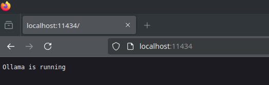

Wie, man kann Large Language Models auf seinem eigenen kleinen Rechner von vor 5 Jahren laufen lassen? Yes, mit Ollama und ein paar anderen tollen Projekten sieht das ganze auch (fast) professionell aus!

## Primer

LLMs (Large Language Modells) sind maschinelle Lernmodelle, die auf großen Mengen an Textdaten trainiert wurden. Sie können verwendet werden, um Texte zu verstehen, zu generieren und zu transformieren. Beispiele für solche Modelle sind BERT (Bidirectional Encoder Representations from Transformers) und transformer-basierte Modell wie XLNet und RoBERTa.

LLMs zu hosten und zu trainieren birgt allerdings einige Herausforderungen.

- **Hoher Rechenbedarf**: Die Trainingsprozesse für LLMs sind computationally aufwendig und benötigen große Ressourcen.
- **Kosten**: Das Deployment eines LLMs auf einem eigenen Server kann teuer sein, insbesondere wenn ein großes Modell trainiert wird.
- **Komplexität**: Der Prozess des Selbsthostens kann komplex sein, insbesondere für Unternehmen ohne Erfahrung in Machine Learning.

### Ollama: Eine Lösung für das Selbsthosten von LLMs

Ollama ermöglicht es, bereits trainierte Large Language Modells zu laden und mit ihnen zu interagieren. Man muss kein eigenes Modell trainieren, sondern kann stattdessen die Vorteile eines etablierten LLM nutzen.

## How to: Setup Ollama

Schnappt euch als erstes einen Linuxrechner (vorzugsweise mit GPU) und (falls nicht getan) updated und upgraded zunächst eure Package-Liste damit euer Linuxrechner up to date ist. Nächster Schritt ist dann Ollama herunterzuladen.

    ```shell
    sudo apt update && sudo apt upgrade
    curl -fsSL https://ollama.com/install.sh | sh
    ```

Dieses Script downloaded und installiert Ollama und startet den Ollama System Service. Um zu überprüfen ob alles gut gelaufen ist kann man einfach den Localhost der Linux-Maschine auf Port 11434 aufrufen. Folgendes sollte auf dieser Website zu sehen sein:



So, da Ollama jetzt am Laufen ist kann man doch gleich loslegen, oder? Nicht ganz, Ollama ist nur eine Art Framework und kein eigenes LLM. Ich stelle es mir gerne so vor wie Docker. Docker allein kann eigentlich nichts. Es wird erst dann richtig mächtig wenn man verschiedene Container lädt und laufen lässt. Genau so oder ähnlich verhält es sich mit Ollama.

Wir könen uns (ähnlich wie bei Docker) einfach ein LLM pullen. Ein beliebtes Modell ist z.B. llama3, welches von Meta stammt.

    ```shell
    ollama pull  llama3
    ollama run  llama3
    ```

Mit `ollama run` starten wir das LLM und können nach einer (mehr oder weniger) kurzen Wartezeit anfangen mit dem Chat Bot zu interagieren.
